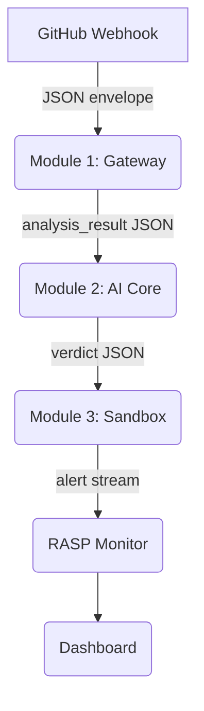

# ResilioCheck AI · Core Platform

> **AI-powered, continuous security validation for your CI/CD pipeline.**  
> ResilioCheck intercepts every push and pull-request, analyses the repository with a LangChain multi-agent OWASP scanner, validates findings inside an isolated Docker sandbox, and enforces a binary gate — **APPROVED** or **BLOCKED** — before any code reaches production.

---

## Table of Contents

- [Introduction](#introduction)
- [Architecture Overview](#architecture-overview)
- [Core Modules](#core-modules)
  - [Module 1 — Integration Gateway](#module-1--integration-gateway)
  - [Module 2 — AI Core](#module-2--ai-core)
  - [Module 3 — Sandbox Validation](#module-3--sandbox-validation)
  - [RASP Monitor](#rasp-monitor)
  - [Dashboard](#dashboard)
- [Directory Structure](#directory-structure)
- [Quick Start](#quick-start)
- [Security Principles](#security-principles)
- [Roadmap](#roadmap)
- [License](#license)

---

## Introduction

ResilioCheck AI is designed to bridge the gap between rapid software delivery and rigorous security compliance. By embedding directly into the CI/CD pipeline, it provides an automated, AI-driven security gate that evaluates code for vulnerabilities, particularly against the OWASP Top 10, and tests suspicious behaviors in an isolated sandbox. It acts as an intelligent firewall for your source code, ensuring that vulnerable code never reaches your production environment.

---

## Architecture Overview

The system is composed of several decoupled microservices that communicate via secure, typed JSON envelopes over HTTP. This ensures isolation and robust error boundaries.



```text
GitHub Webhook
      │
      ▼
┌─────────────────────┐
│  Module 1           │  src/gateway/
│  Integration        │  FastAPI webhook controller
│  Gateway            │  Pydantic-validated input
└────────┬────────────┘
         │ JSON envelope
         ▼
┌─────────────────────┐
│  Module 2           │  src/engine/
│  AI Core            │  LangChain multi-agent pipeline
│  (LangChain+Groq)   │  ChromaDB vector store
└────────┬────────────┘
         │ analysis_result JSON
         ▼
┌─────────────────────┐
│  Module 3           │  src/sandbox/
│  Sandbox            │  Docker-isolated test harness
│  Validation         │  Allowlisted images only
└────────┬────────────┘
         │ verdict JSON
         ▼
┌─────────────────────┐
│  RASP Monitor       │  src/monitor/
│  (continuous)       │  Live payload interception
│                     │  Pre-compiled threat patterns
└────────┬────────────┘
         │ alert stream
         ▼
┌─────────────────────┐
│  Dashboard          │  src/dashboard/
│  (Streamlit)        │  Operational control plane
│                     │  Gate status · Event log
└─────────────────────┘
```

---

## Core Modules

### Module 1 — Integration Gateway
**Location:** [`src/gateway/controller.py`](src/gateway/controller.py)

The Gateway is a FastAPI application that acts as the single inbound surface for all GitHub webhook events. It sanitizes and normalizes incoming data before dispatching it to the AI core.

| Feature | Implementation |
|---------|---------------|
| **Input Validation** | Pydantic v2 models — every field validated before business logic |
| **Path Traversal Prevention**| `full_name` field validator rejects illegal characters |
| **SHA Validation** | Regex whitelist — only `[0-9a-f]{7,40}` accepted |
| **Error Handling** | Opaque `error_id` UUID returned; full trace written to log file |
| **Engine Dispatch** | Isolated HTTP call — no shared memory between services |
| **Health Probe** | `GET /health` endpoint for liveness checks |

### Module 2 — AI Core
**Location:** [`src/engine/analyzer.py`](src/engine/analyzer.py)

The AI Core orchestrates a chain of specialized LangChain agents that perform static analysis against the OWASP Top 10 vulnerabilities.

#### Agent Pipeline
1. **`CodeFetchAgent`**: Clone repo, chunk source files by function/class boundary.
2. **`EmbeddingAgent`**: Upsert chunks into ChromaDB with metadata.
3. **`OWASPAgent`**: Run OWASP Top-10 checklist prompts via Groq LLM.
4. **`GateDecisionAgent`**: Synthesize a binary `APPROVED` / `BLOCKED` verdict.

*Security Design:* All LLM prompts are parameterized templates stored in [`config/prompts.py`](config/prompts.py). No `eval()` or `exec()` is used. Agent outputs are parsed through typed Pydantic models.

### Module 3 — Sandbox Validation
**Location:** [`src/sandbox/runner.py`](src/sandbox/runner.py)

The Sandbox spins up a Docker container from an **allowlisted** image, executes a pre-baked test harness script, and returns a structured verdict based on the runtime execution behavior.

#### Hardened Container Configuration
| Setting | Value |
|---------|-------|
| Root filesystem | `read_only=True` |
| Linux capabilities | `cap_drop=["ALL"]` |
| Privilege escalation | `no-new-privileges:true` |
| Memory limit | `512 MB` |
| CPU quota | `50 %` of one core |
| Timeout | `120 s` (configurable via `SANDBOX_TIMEOUT_SECONDS`) |
| Image allowlist | Only pre-approved `resiliocheck/*` images |

### RASP Monitor
**Location:** [`src/monitor/interceptor.py`](src/monitor/interceptor.py)

The Runtime Application Self-Protection (RASP) monitor intercepts live HTTP payloads and scans them against pre-compiled threat patterns for immediate threat neutralization.

| Pattern Class | Severity |
|--------------|---------|
| SQL Injection | CRITICAL |
| Remote Code Execution | CRITICAL |
| Cross-Site Scripting | HIGH |
| Server-Side Request Forgery | HIGH |
| Path Traversal | MEDIUM |

*Note: All matched snippets are HTML-escaped before logging to prevent log injection.*

### Dashboard
**Location:** [`src/dashboard/app.py`](src/dashboard/app.py)

A Streamlit-based operational control plane providing visibility and manual control over the pipeline.
- GitHub repository URL input with Pydantic validation before dispatch.
- Live pipeline gate status cards (APPROVED / BLOCKED / PENDING) per module.
- Recent analysis event log with color-coded verdicts.
- System settings panel (wired to environment config).

---

## Tech Stack & Required APIs

To successfully run and develop ResilioCheck AI, your team will need the following tech stack and API keys.

### 🛠️ Core Tech Stack
- **Python 3.10+**: The primary programming language for all backend logic.
- **FastAPI**: High-performance asynchronous web framework used for the Gateway, AI Engine, and Sandbox microservices.
- **Streamlit**: Python-based frontend framework used to rapidly build the operational Dashboard UI.
- **LangChain**: The framework used to orchestrate the multi-agent AI pipeline.
- **ChromaDB**: An open-source, locally run vector database used to store code embeddings for semantic search.
- **Docker**: Containerization platform required for the Sandbox module to execute untrusted code in an isolated environment.

### 🔑 Required APIs & Materials
To configure your `.env` file, you must acquire the following tokens:

1. **Groq API Key (`GROQ_API_KEY`)**
   - **Purpose:** Powers the core AI analysis. Groq provides ultra-fast LLM inference (using models like `llama-3.3-70b-versatile` or Llama 3 via OpenAI-compatible endpoints).
   - **How to get it:** Register at [console.groq.com](https://console.groq.com/) and generate an API key. 
2. **GitHub Personal Access Token (`GITHUB_TOKEN`)**
   - **Purpose:** Allows the AI engine to automatically branch, commit patched code, and generate Pull Requests on your repository.
   - **How to get it:** Go to your GitHub account Settings > Developer Settings > Personal Access Tokens. Generate a classic token with the `repo` scope enabled.

### ❓ Frequently Asked Questions
- **Do we need a LangChain API key?** 
  **No.** LangChain itself is just a free Python package that runs locally. You only need a LangChain API Key (`LANGCHAIN_API_KEY`) if you want to use **LangSmith**, which is an optional tool for tracing and debugging your LLM prompts. 
- **Do we need an OpenAI API key?** 
  **No.** While the codebase uses the OpenAI SDK format for compatibility, it routes the requests to Groq's high-speed inference engine via the `openai/gpt-oss-20b` endpoint configuration.

---

## Directory Structure

```text
resiliocheck-core/
├── src/
│   ├── gateway/          # Module 1 — FastAPI webhook controller
│   │   └── controller.py
│   ├── engine/           # Module 2 — LangChain AI multi-agent core
│   │   └── analyzer.py
│   ├── sandbox/          # Module 3 — Docker test runner
│   │   └── runner.py
│   ├── monitor/          # RASP continuous payload interceptor
│   │   └── interceptor.py
│   └── dashboard/        # Streamlit operational UI
│       └── app.py
├── tests/                # Benchmark suite (intentionally vulnerable targets)
├── config/               # System prompts & environment settings
│   ├── settings.py
│   └── prompts.py
├── .env.example          # Environment variable template
├── .gitignore
└── requirements.txt
```

---

## Quick Start

```bash
# 1. Clone & enter the repository
git clone https://github.com/your-org/resiliocheck-core.git
cd resiliocheck-core

# 2. Create a virtual environment and install dependencies
python -m venv .venv
source .venv/bin/activate        # Windows: .venv\Scripts\activate
pip install -r requirements.txt

# 3. Configure environment variables
cp .env.example .env
# Edit .env and set GROQ_API_KEY (and others as required)

# 4. Start the Gateway (terminal 1)
uvicorn src.gateway.controller:app --host 0.0.0.0 --port 8000 --reload

# 5. Start the Dashboard (terminal 2)
streamlit run src/dashboard/app.py --server.port 8501
```

---

## Security Principles

ResilioCheck enforces the following across every module:

1. **OWASP Top-10 Compliance** — No raw string query construction, no dynamic evaluation.
2. **Pydantic v2 Validation** — All HTTP inputs validated at the boundary before processing.
3. **Decoupled Modules** — Services communicate exclusively via typed JSON envelopes over HTTP.
4. **Opaque Error Responses** — Stack traces and file paths are written to private logs only; callers receive an `error_id` UUID.
5. **Image Allowlisting** — The Docker sandbox accepts only pre-approved images.
6. **Pre-compiled Patterns** — RASP threat detection uses compiled `re.Pattern` objects, never user-constructed regex.

---

## Future Work: GitHub App Integration

While the current architecture leverages a backend bot token (Personal Access Token) for rapid Proof-of-Concept testing and seamless automation on public repositories, the production roadmap includes migrating to a formal **GitHub App Integration**.

Implementing a GitHub App will introduce several enterprise-grade benefits:
- **Private Repository Support**: Organizations can install the ResilioCheck App to securely grant explicit access to their private codebases.
- **Granular Permissions**: The App will request strictly scoped permissions (e.g., `Read: Code`, `Write: Pull Requests`), improving security over global tokens.
- **Short-Lived Installation Tokens**: The backend will dynamically request temporary credentials per repository, ensuring zero-trust credential management.
- **Bot Identity**: Automated Pull Requests and security patches will be officially authored by the `ResilioCheck AI` bot instead of a personal user account.

---

## Roadmap

- [ ] **Sprint 2** — Wire `CodeFetchAgent` and `EmbeddingAgent` to ChromaDB
- [ ] **Sprint 3** — Integrate Groq LLM into `OWASPAgent` and `GateDecisionAgent`
- [ ] **Sprint 4** — Build benchmark vulnerable apps in `tests/`
- [ ] **Sprint 5** — Kubernetes deployment manifests & Helm chart

---

## License

Proprietary — All rights reserved · ResilioCheck AI
